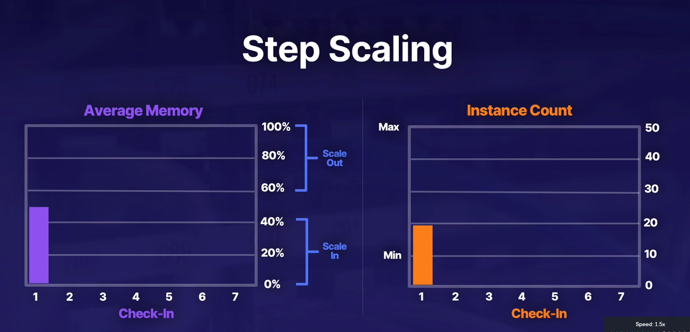
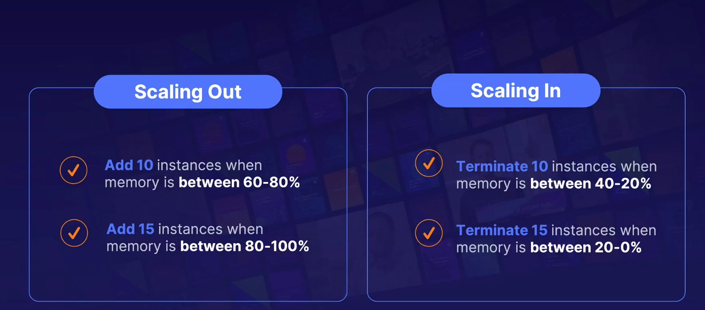
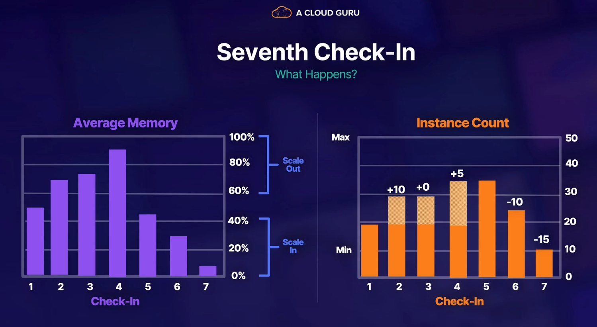

## step scaling

## instance warm up and coll down

- warm up - stops instances from being behind the load balancer, failing the health checks and being terminated
- cooldown - pauses auto scaling for a set amount of time. Helps avoiding runway scaling events
- avoid thrashing - create instances quickly and spi them down slowly.

## scaling types

- reactive scaling - playing catchup - once load is there, you measure it and determine if you need to create more resources
- scheduled - predictable workload, scaling event ti get resources reay to go before they are actually nedded
- predicitive scaling - AWS uses its machine leatning to determine when you will need to scale. reevaluated every 254 hours and create a forecast for next 48

- steady state group - min 1, max 1,desired 1. Need to be always available bu no need to scale. if instance deleted, spun up under the mentioned subnets

> know cost implications, reason why you might want to changes numbers
>
> scale out aggresively
>
> scale in conservatively
>
> provisioning - keep eye on probisioning to minimize it
>
> costs - use EC2 RIs for minimiust count of ec2 instances
>
> CW - numbner 1 tool for alertung auto scaling that you need more or less of something
>
> ELB are esential - enable healthchecks from load baancers, otherwise instances wont be terminated and replaced