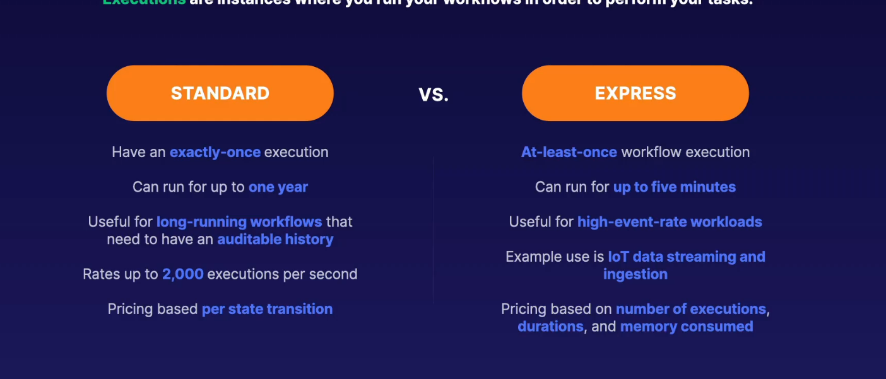

## step functions

- serverless orchestrations combining aws services for business apllications
- graphical console for easier application workflow views
- components - state machines and tasks
- state machine - particular workflow with different event-driven steps
- task - specifi states within a workflow respresenting s single unit of work
- states - every single step within a workflow is considered a state

## worflows

## states and state machines

- flexible - decisioin vbased on input, perform certain actions or pass output
- states and workflows are defined in amazon states language
- states - elements within your state machines

## different staates

- pass - passes input directly to output - no work
- task - single unit of work performed
- choice - adds branching logic to state machines
- wait creates a specified time delay
- succeed - stops execution sucessfully
- fail -stops and marks them ass failure
- parallel - run parallel branches of executions within state machines
- map - runs a set of steps based on elemts of an input array

> states- step functions
>
> serverless orchestration service -step functinos
>
> different workflow decision requirements - condition checks, failure catrches, wait periods
