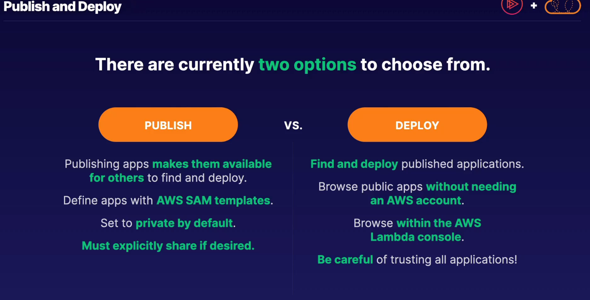

## serverless app repo

* find, deploy or publish their own serverless applications
* privately share within orgs
* uploadd code and a manifest file, known as AWS sam template
* integrations - integrated with AWS lambda, appears within the console

> define wjole apps via aws sam templates, private by default
>
> publish or deploy - choice of publishing own aps or deploying publicly available
>
> heavily integrated with lambda