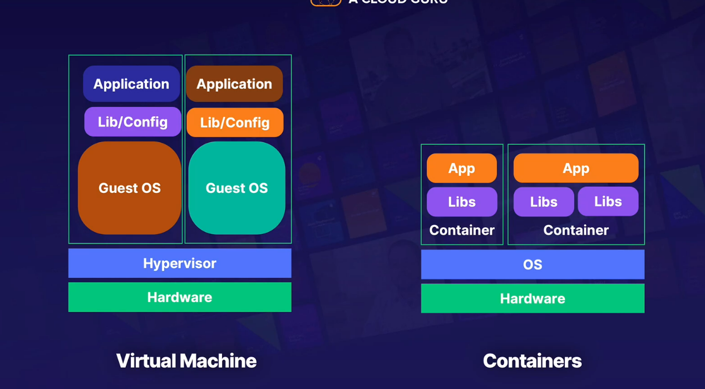

## container

- oackages up code and dependencies so app can run quickly and reliably from one computing env to another

* dockerfile - instructions that will be used to build an image
* image - immutable file that contains the code, libraries, dependencies, config of the app
* registry - stores images for distribution, can be public and private
* container - a running copy of the image created

> containers are more flexible
>
> easier to run on site and to different environments
>
> containers help easily migrate from on premise to AWS
>
> open source-kubernets
>
> fargate cant work alone - need ecs orr eks
>
> prefer to use container than ec2 on the exam
>
> storage/image scanning - ecr