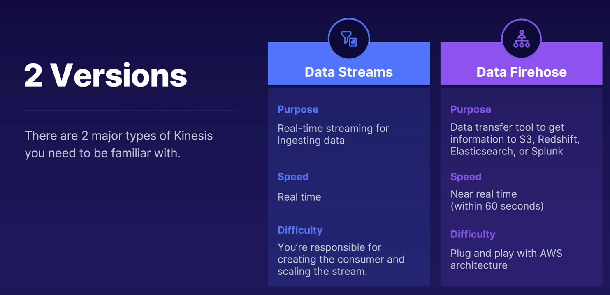

## kinesis

- ingest, process and analyzze real time streaming data

## data stream vd firehouse

## kinesis data nalytics using SQL

- easy - very easy to die data analytics to kinesis pipeline
- directly supported by firehose and data streeams
- serverless
- automatically handle scaling and provisioning of needed resources
- only pay for the amount of resources you consume as data passes throuh

## kinesis vs sqs

- sqs - no real time delivery, easier and simpler
- kinesis- more complicated and used in big data but ffers real time, so faster and can store data for up to a year

> real time - kinesis
>
> near real time - data firehose
>
> real time - data streams
>
> streaming - kensis
>
> transforming data - data analustics easiest to process data going through kinesis using sql
>
> scaling - data streams dont automatically scale, firehose does