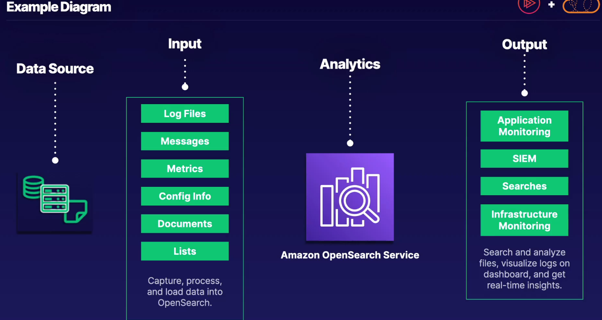

## opensearch

- run seearch and analytics engines for various use cases

## features

- quick analy7sis - ingest, seach and analyse. part of etl
- scalable - easily scale cluster infra running open source opensearch services
- security - leverage IAM for access control, vpc sec groups, encryption at rest and in transit, field level security
- stability- multi az capable service with master nodes and automated snapshots
- flexible - allows for sql support for BI apps
- integration - integrate with cq, cloudtrail, s3, kinesis

> logs visualisation or bi reports - opensearch
>
> elastic search is the same thing
>
> managed analytics and visualisation service
>
> analyse logs -opensearch