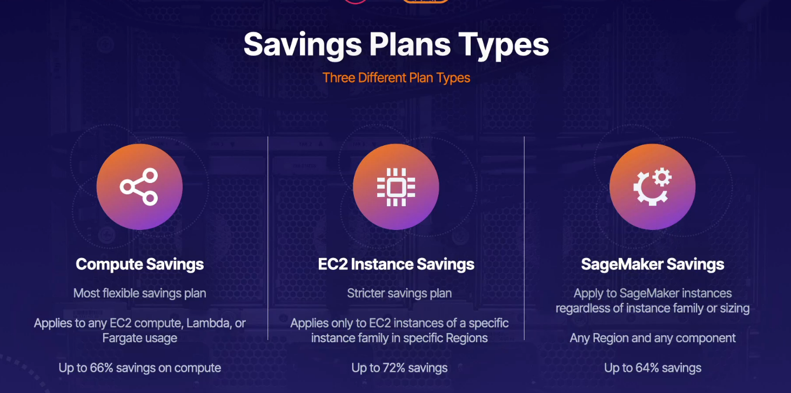

## compute optimizer

- analysses config and utilisation of metrics of aws resources
- reports current usage optimizations and potential recommendations
- grpahs - provides graphical hidtory data and projected utilization metrics
- use graphs, metric data and recommendations for moving or resizing resources

## services

- ec2, asg, ebs, lambda

## supported accounts

- aws account without organization eanabled
- member account - single account within aws org
- management account - organaization management account fro whole organization

## things to know

- disabled by default
- opt in to levarage compute optimizer
- enhance recommendations via activation of recommendation preferences

## saving plans

- flexible pricing models
- save upto 72% on compute
- lower prcies for ec2 instances regradless of ninstance, size, os,tenacy, regiuons
- aws lambda and fargate usage
- sagemaker lower instance pricing
- provided as a trade for long term commitments, 1 or 3 years
- choose from all upfront, partial upfront or no upfront

## using and applyinh

- view recommendation in your blling console
- recommendations are automatically coalculated to make purchase easier
- add to cart and purchase directly within aws account
- apply to usage rates after RI are applied and exhausted
- consolidated billing family: applied to account owner first and then be spread to others

> 