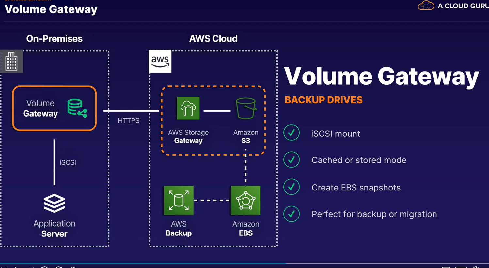
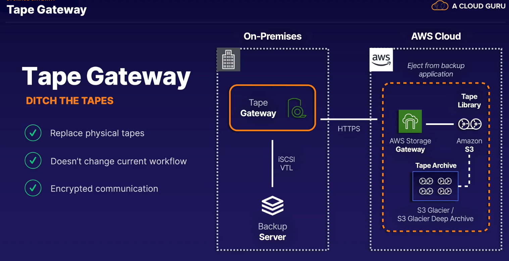

## storage gateay

- hybrid cloud storage service that helps merge on premise resources with cloud
- can help in one time migration or long term pairing of your arch with aws
- run locally as a vm on premise

- if local network attached is full

> storage gateay is a hybrid solution
>
> on premise storage/hybrid storage - storage gateway
>
> out of space on prem? which storage gateway