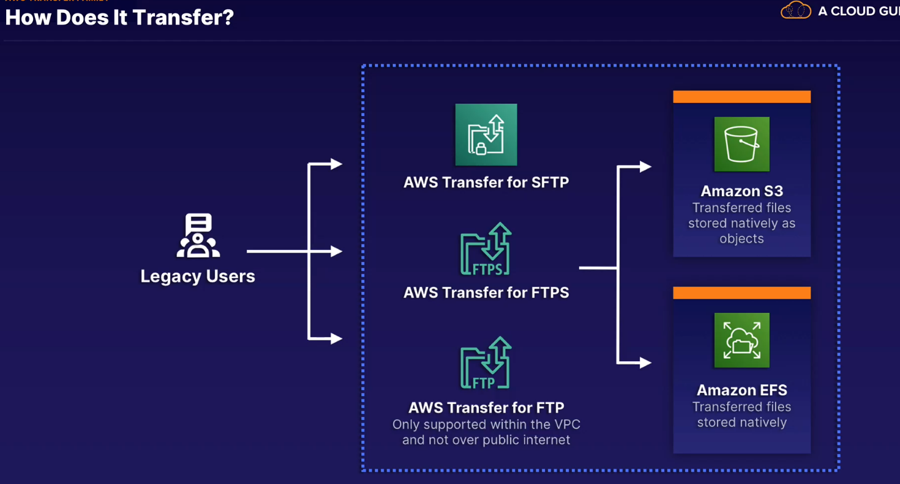

### transfer family

- easily move files in and out of s3.efs using sftp, ftps, or ftp
  

> used mnainly when you have a collection of older application using protocols that are old
>
> legacy app storage to cloud
>
> dns entry stays same but location for storage becomes s3