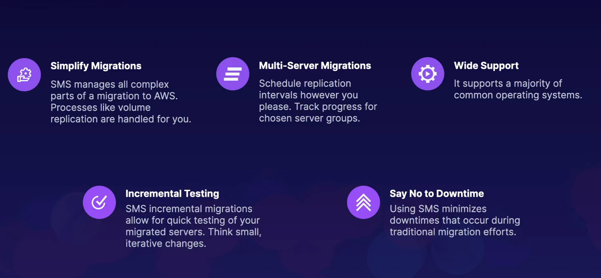

## migration hub

- discover ecisting servers, plan migration efforts, track migration statuses
- visualize connection snd server db statuses
- options to start migration immediatel  or group server into application groups first
- integrates with application migration service/ db migration service
- only discovers and plans migration, and works with the mentioned services to actially d the migrations

## mmigration phases

- discover: find servers and db
- ,igrate - connect tools to migration hub and begin migratinig
- track - follow migration statuses and progress

## SMS

- automate migrating on premise server to aws cloud
- supports csphere, hyperv, scvmm and azure vms
- incremental replications of server vms ver to aws amis that can  be deployed aon amazon ec2

## uses

> tracking and planning migration efforts from either on premisse or another cloud endor - migration hub
>
> 