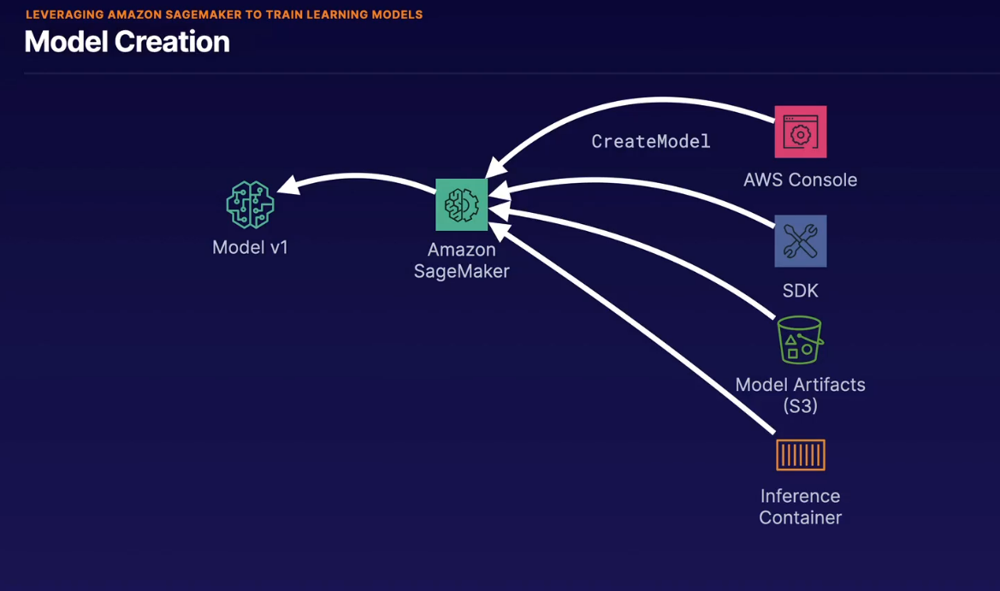

## sagemaker

- way to build and deploy ML models

## stages

1. create a odel - provide predictions for endpoint
2. create endpoint config - specifythe model to use, inference instance type, instance count, variant name and weight. called productions variant
3. create endpoint - model is published and can invoke model using invokeendpoint method

- load own model or buy model from marketplace

## sagemaker neo

- customize ML models for specific cpu hardware such as arm, intel, nvidia processors
- includes a complier to convert the machine learning model to an environment thaat is optimized to execute the model on the target arch

## elastic inference

- speeds through oput and decreases laency of real time inferencess deployed in sagemaker hosted services using only cpu based instances.
- much more cost effectie than full gpu instance
- must be configured when create a deployable model
- EI not avalable for all algos yet
- cost saving _EI

## automatic scaling - 

- provisioned

## high availability

- recommended to deploy on multiple AZ for high availability

> training, devloepming, deploying ML model - sagemaker