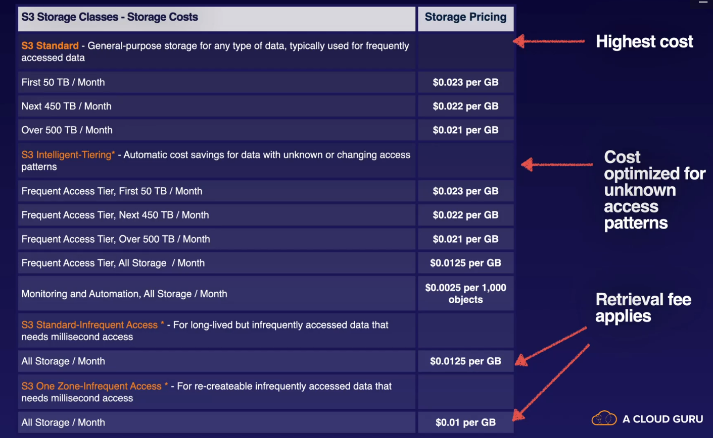

## s3 standard

* high availability
* redundant across multple AZs
* 9.99 availablility
* 99..99 11 9s durability
* designed for frequent access
* default storage
* website, content distribution, mobile apps, big data analytics

## s3 standard infrequent access s3 IA
* rapid access - accessed less frequently but requires rapid access when needed
* pay to access the data
* low per gb storage rpcie and per gb retrieval fee
* long term storage, backups, data store for disaster recovery files
* 99.99 availablity
* 11 9s durability

## s3 one zone IA

* 20% less cost than S3 standard IA
* long lived infrequently accessed non critical data
* 99.5 vailabiltiy
* 11 9s durability
  
## frequent and infrequent access

* automatically moves your data to the most effective tier based on frequency of access of each object
* 99.99 availablity
* 11 9s durabiltiy
* monthly fee of 0..023 dollars per 1000 objects

## glacier options

* pay each time to access data
* archiving data
* cheap storage
* data that is very infrequently accessed
* 99.99 availablitliy
* 11 9s durability
* >= 3 AZs

### glacier instant retrieval

* long term data archiving with instant retrieal time

### glacier flexible retrieval

* archive data that does not require immediate access but retrieve large sets of data at no cost such as backup or disaster recovery use case.
* can be minute to up to 12 hours

### glacier deep archive

* cheapest storage class abnd designed for customers that retain data sets for 7-10 years
* standard retrieval time is 12 hours and bul retrieval time is 48 hours

