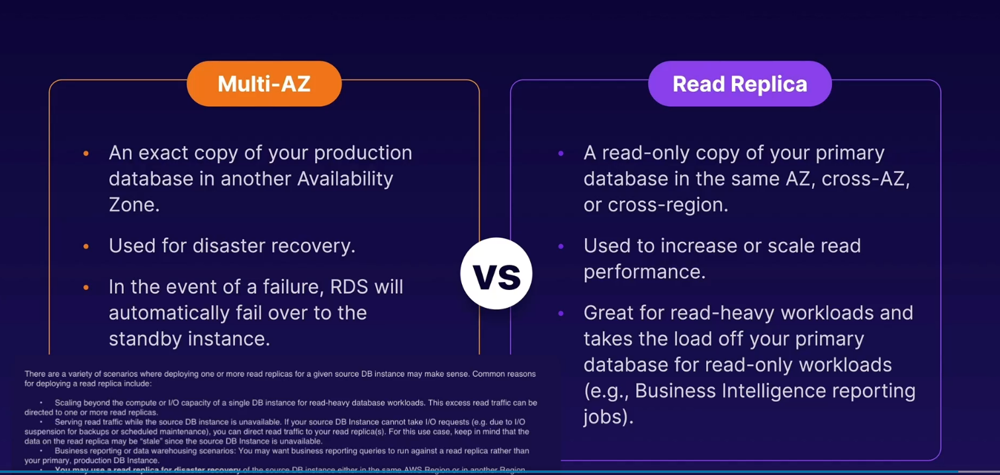

## read replica

* read only copy of your primary db
* this is for scalability, however can be used for disaster recovery
* has its own dns end point
* can be promotoed to be their own db - breks the replication
* automatic backups must be enabled in order to deploy a read replica
* upto 5 read replicas for each instance
  
