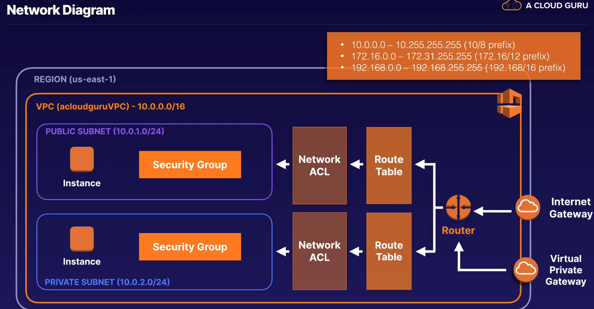

## vpc

* virtual data center in the cloud
* isolated part of cloud where you can define your network
* completee control on virtual network, including ip address, subnets, route tables
* fully customizable network
* leverage multiple sec laers like sec groups and Network ACLS to help control access to ec2 in each subnet
* web - public facing subnet
* application - private subnet - can only talk to web tier and db tier
* db- private subnet - can only talk to application tier
* hardware vpn - connection between your corporate data center to aws cloud to use aws features

## features

* launch instance to your subnet
* custom IPs
* routbe table between subnets
* internet gatewat attached to vpv
* more control for better security
* access control lists to provide access

* default vpc - user friendly
* * all subnets have a route to internet
* * each ec2 has both public and private ip
* cusomt - fully customizable, takes time to sent up

> 1 subnet is always in 1 AZ
>
> first 4 ip address and  last one in each subnet cidr block is not available
>
> .0 - network address

> .1 - preserved by aws for vpc router
>
> .2 reserverde by aws . tne ip address of the dns server is the base of the vpc network range plus two
>
> .3 reserved by aws for furutre use
>
> .255 network broadcast address
>
> so only 251 available
>
> 1 internetgateway per vpc