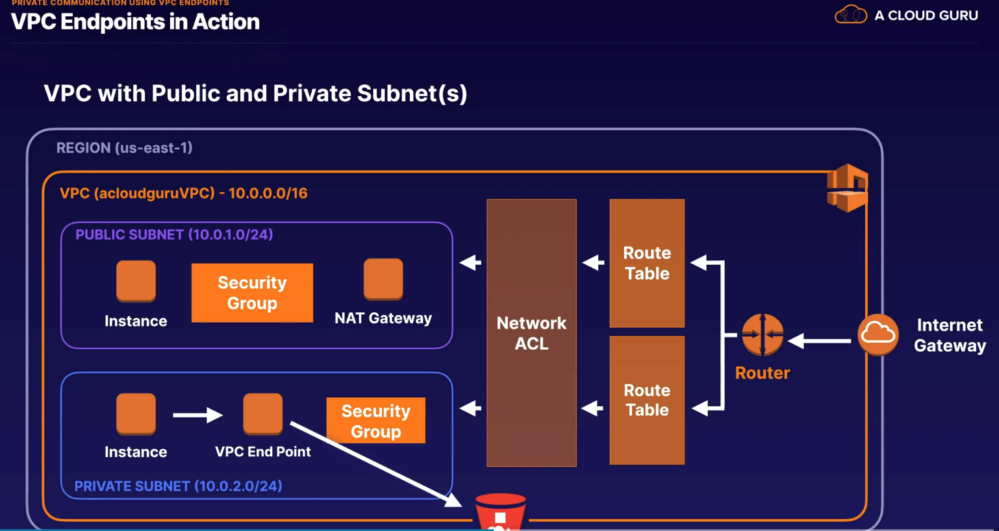

## vpc endpoints

* privatelly connect to vpc
* does not require nat, internet gatewat, vpn or direct connect
* instances in vpc donto need ip to communicate
* traffic between vpc and other service donoto leave the amazon network
* virtual devices- horizonatally scaled, highly available, allow communication between instances in vpc
* two types:
* 1. interface enpoint - elastic network interface with a private ip that serves as an entry point for traffic headed to a supported service.  they support large number of aws services
* 2. gateway endpoints - similar to NAT gateways, virtual device you provision. supports connection to s3 and dynamodb 

> connect to services without leaving amazon internal network