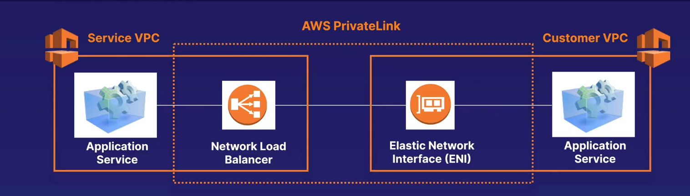

## sharing apps across vpc

* open vpc to internet
* * everything in public subnet is public
* * a lot more to manage
* vpc peering - create and manage many different peering relationships
* * whole nettowkr will be accessible not good if you have multiple applications in your vpc

## privatelink

* expose a service vpc to thousands of customer vpc
* no vpc peering , no route tables, nar gateways, internet fatewat etc
* requires a network load balanmcer on the service vpc and an ENI on the customer vpc

> peering vpc to 1000 vpc - private link