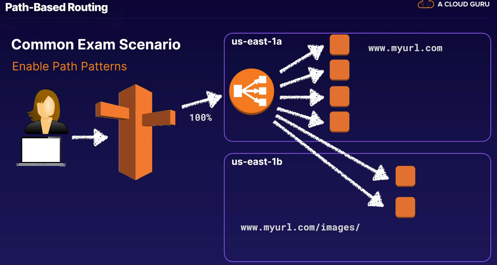

## apllication load balancer

### layer 7 load balancing

* after it receives a reuest, evaluates the listeener rules in priority order to determine which rule to apply and then selects a target from the target group for the rule action
* can enable sticky session for ALB but traffic will be sent at target group level

## listeners

* listeneer checks for connection requests from clients using the protocol and port you configure
* you define rules that determine how the load balancer routes requests to its regisered targets
* each rule consists of a priority, one or more actions and one or more conditions

## rules

* when rules met, action is performed
* must define default rule, optionally define dditional rules

## target group

* request to one or more registered targets such as ec2 insances from the port you specifiy

## path based routing

## limitations

* only suppport http/https

## https load balancing

* must deploy ssl certificate on load balancer
* load balancer uses a server certificate to terminate the frontend connection and then decrypt requests from clients before sending them to the targets
* decryption  done on the load balancer

> 